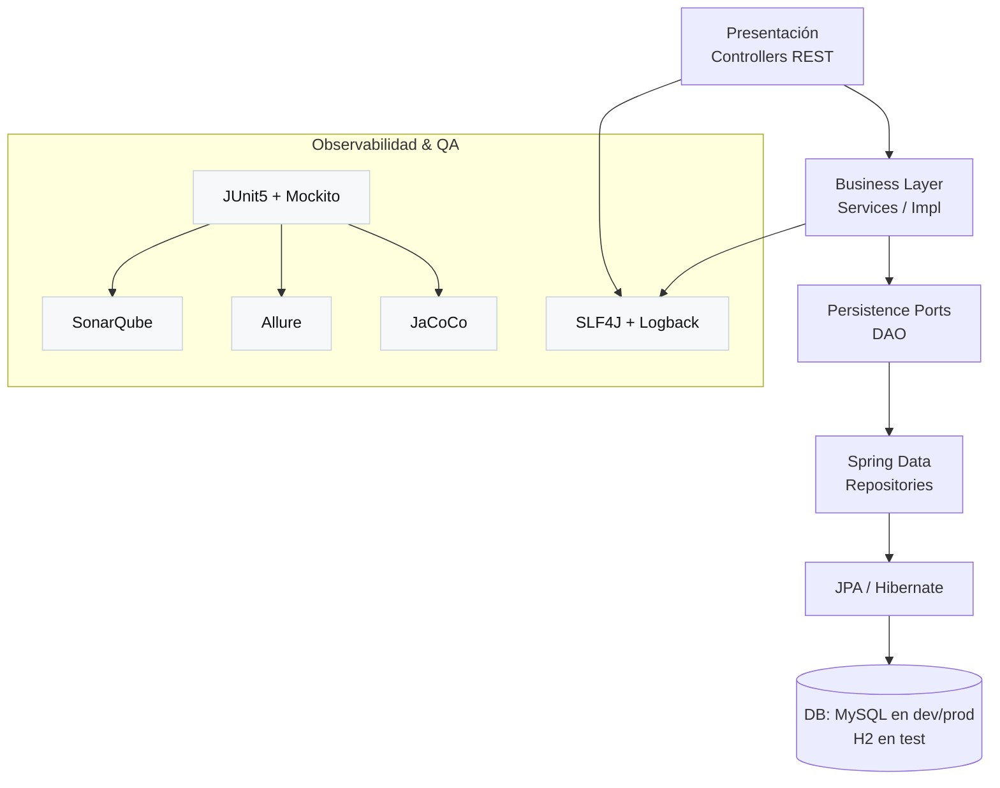

# Accommodation Management

Proyecto final de **Programación Avanzada**.
API de gestión de alojamientos (alojamientos, reservas, usuarios, etc.) basada en **Spring Boot** con arquitectura por capas (controllers → services → DAOs → persistence).

## ✨ Tecnologías

* **Java 21**, **Gradle** (wrapper incluido)
* **Spring Boot 3.5.x**: Web, Validation, Data JPA
* **Base de datos**: MySQL (runtime), **H2 en memoria** (tests)
* **Documentación**: SpringDoc OpenAPI (Swagger UI)
* **MapStruct** (mapeo DTO ↔ entidades), **Lombok**
* **Testing**: JUnit 5, Mockito
* **Calidad**: **JaCoCo** (cobertura) + **SonarQube**
* **Reportes**: **Allure** (opcional)

## 📁 Estructura (resumen)

```
src
├── main
│   ├── java/com/uniquindio/proyecto_final/accommodation_management
│   │   ├── presentation.controllers   # Endpoints REST
│   │   ├── businessLayer
│   │   │   ├── dto                    # DTOs
│   │   │   ├── service                # Interfaces de servicios
│   │   │   └── service/impl           # Implementaciones (con logs)
│   │   └── persistenceLayer
│   │       ├── dao                    # Puertos/DAO
│   │       ├── entity                 # Entidades JPA
│   │       └── repository             # Spring Data repos
│   └── resources
│       ├── application.properties / -dev / -prod / -test
│       └── api.yaml                   # OpenAPI
└── test
    ├── java/...                       # Tests unitarios (JUnit + Mockito)
    └── resources/logback-test.xml     # Logs DEBUG en tests
```

## 🧱 Arquitectura (diagrama)



## ⚙️ Requisitos

* **JDK 21**
* **MySQL** (para `dev`/`prod`)
* **Docker** (opcional para SonarQube)
* **Allure CLI** (opcional; vía Scoop o zip manual)

## 🔧 Configuración de perfiles

* `dev`: desarrollo local con MySQL.
* `prod`: producción.
* `test`: tests con H2 en memoria (activado desde Gradle al ejecutar `test`).

> `build.gradle` ya activa `spring.profiles.active=test` durante los tests.

## ▶️ Ejecución

### 1) Levantar la app

```bash
# Unix/Mac
./gradlew bootRun

# Windows
.\gradlew bootRun
```

Swagger UI:

```
http://localhost:8080/swagger-ui/index.html
```

### 2) Tests + cobertura

```bash
./gradlew clean test jacocoTestReport
# Windows: .\gradlew clean test jacocoTestReport
```

Reportes HTML:

* **JUnit**: `build/reports/tests/test/index.html`
* **JaCoCo**: `build/reports/jacoco/test/html/index.html`

#### Apertura rápida (tareas de conveniencia)

```bash
# Abre ambos reportes (JUnit + JaCoCo)
./gradlew openReports               # Windows: .\gradlew openReports

# Individuales
./gradlew openUnitTestReport
./gradlew openJacocoReport
```

> En Windows usamos `cmd /c start` para abrir el navegador.

## 📊 SonarQube (local con Docker)

```bash
docker run -d --name sonarqube-lts -p 9000:9000 sonarqube:lts-community
docker logs -f sonarqube-lts   # esperar "SonarQube is operational"
```

1. Entra a `http://localhost:9000` y crea **token** (Mi cuenta → Tokens).
2. Ya está configurado en `build.gradle`:

```groovy
sonarqube {
  properties {
    property "sonar.host.url", "http://localhost:9000"
    property "sonar.projectKey", "accommodation-management"
    property "sonar.coverage.jacoco.xmlReportPaths",
             "build/reports/jacoco/test/jacocoTestReport.xml"
  }
}
```

3. Ejecuta análisis:

```bash
# Pasando token por parámetro:
./gradlew test jacocoTestReport sonarqube -Dsonar.token=TU_TOKEN

# O con variable de entorno:
#   Windows (nueva terminal):  setx SONAR_TOKEN TU_TOKEN
#   Unix/Mac (actual):        export SONAR_TOKEN=TU_TOKEN
./gradlew test jacocoTestReport sonarqube -Dsonar.token=%SONAR_TOKEN%   # Win
./gradlew test jacocoTestReport sonarqube -Dsonar.token=$SONAR_TOKEN    # Unix/Mac
```

## 📈 Allure (opcional)

**Instalación (Windows con Scoop)**

```powershell
Set-ExecutionPolicy RemoteSigned -Scope CurrentUser -Force
iwr -useb get.scoop.sh | iex
scoop install git
scoop bucket add extras
scoop install allure
allure --version
```

Si prefieres zip manual, descomprime y agrega en `gradle.properties`:

```
allureExecutable=C:\\ruta\\a\\allure\\bin\\allure.bat
```

**Generar/abrir reportes Allure**

```bash
./gradlew openAllureReport   # genera build/allure-report e intenta abrir index.html
./gradlew allureServe        # servidor temporal (dashboard interactivo)
```

> Fuente de resultados: `build/allure-results` (configurado en `test`).

---

## 🌐 Endpoints principales (resumen)

> **Nota**: las rutas exactas pueden variar según los controllers.
> La **fuente de verdad** es **Swagger UI**: `http://localhost:8080/swagger-ui/index.html`.
> A continuación, una **guía orientativa** basada en los servicios y DTOs del proyecto.

| Recurso              | Método          | Ruta (orientativa)                  | Descripción                  | Body (DTO)                 | Respuesta                    |
| -------------------- | --------------- | ----------------------------------- | ---------------------------- | -------------------------- | ---------------------------- |
| Usuarios             | POST            | `/users`                            | Crear usuario                | `UserDTO`                  | `UserDTO`                    |
|                      | POST            | `/users/login`                      | Login usuario                | `LoginDTO`                 | `UserDTO`                    |
|                      | PUT             | `/users/{id}`                       | Editar nombre/datos          | `UserDTO`                  | `Optional<UserDTO>`          |
|                      | PUT             | `/users/{id}/password`              | Cambiar contraseña           | `ChangePasswordDTO`        | `Optional<UserDTO>`          |
|                      | PUT             | `/users/{id}/recovery`              | Recuperar contraseña         | `String newPassword`       | `Optional<UserDTO>`          |
| Hosts                | POST            | `/hosts`                            | Crear host                   | `HostDTO`                  | `HostDTO`                    |
|                      | PUT             | `/hosts/{id}`                       | Editar host                  | `HostDTO`                  | `Optional<HostDTO>`          |
|                      | PUT             | `/hosts/{id}/password`              | Cambiar password             | `ChangePasswordDTO`        | `Optional<HostDTO>`          |
|                      | PUT             | `/hosts/{id}/recovery`              | Recuperar password           | `String newPassword`       | `Optional<HostDTO>`          |
|                      | POST            | `/hosts/login`                      | Login host                   | `LoginDTO`                 | `HostDTO`                    |
| Alojamientos         | POST            | `/accommodations`                   | Crear alojamiento            | `AccommodationDTO`         | `AccommodationDTO`           |
|                      | GET             | `/accommodations/available`         | Buscar disponibles           | —                          | `List<AccommodationDTO>`     |
|                      | GET             | `/hosts/{hostId}/accommodations`    | Alojamientos por host        | —                          | `List<AccommodationDTO>`     |
|                      | PUT             | `/accommodations/{id}`              | Editar precio                | `AccommodationDTO` (price) | `Optional<AccommodationDTO>` |
|                      | DELETE (lógico) | `/accommodations/{id}`              | Desactivar (active=false)    | —                          | `Optional<AccommodationDTO>` |
|                      | GET             | `/accommodations/{id}`              | Detalle                      | —                          | `AccommodationDTO` | `null`  |
|                      | GET             | `/accommodations/{id}/average`      | Nota promedio                | —                          | `Double`                     |
| Reservas             | POST            | `/reservations`                     | Crear                        | `ReservationDTO`           | `ReservationDTO`             |
|                      | GET             | `/accommodations/{id}/reservations` | Ver reservas del alojamiento | —                          | `List<ReservationDTO>`       |
|                      | GET             | `/users/{id}/reservations`          | Historial de usuario         | —                          | `List<ReservationDTO>`       |
|                      | GET             | `/reservations/{id}`                | Detalle reserva              | —                          | `ReservationDTO` | `null`    |
|                      | PUT             | `/reservations/{id}/accept`         | Aceptar solicitud            | —                          | `ReservationDTO` (200) | 404 |
|                      | PUT             | `/reservations/{id}/reject`         | Rechazar solicitud           | —                          | `ReservationDTO` (200) | 404 |
|                      | PUT             | `/reservations/{id}/cancel`         | Cancelar                     | —                          | `ReservationDTO` (200) | 404 |
| Comentarios          | POST            | `/comments`                         | Crear comentario             | `CommentDTO`               | `CommentDTO`                 |
|                      | GET             | `/accommodations/{id}/comments`     | Listar por alojamiento       | —                          | `List<CommentDTO>`           |
|                      | POST            | `/comments/{id}/responses`          | Responder comentario         | `CommentDTO`               | `CommentDTO`                 |
| Respuestas           | POST            | `/responses`                        | Guardar respuesta            | `ResponseDTO`              | `ResponseDTO`                |
| Ciudades             | POST            | `/cities`                           | Crear                        | `CityDTO`                  | `CityDTO`                    |
| Departamentos        | POST            | `/departments`                      | Crear                        | `DepartmentDTO`            | `DepartmentDTO`              |
| Servicios (catálogo) | POST            | `/services`                         | Crear servicio               | `ServiceDTO`               | `ServiceDTO`                 |
| Rol                  | POST            | `/roles`                            | Crear rol                    | `RoleDTO`                  | `RoleDTO`                    |
| Imágenes             | POST            | `/images`                           | Guardar imagen               | `ImageDTO`                 | `ImageDTO`                   |
| Documentos legales   | POST            | `/legal-documents`                  | Guardar                      | `LegalDocumentDTO`         | `LegalDocumentDTO`           |
| Calificaciones       | POST            | `/qualifications`                   | Guardar                      | `QualificationDTO`         | `QualificationDTO`           |
| Favoritos (aloj.)    | POST            | `/favorite-accommodations`          | Guardar                      | `FavoriteAccommodationDTO` | `FavoriteAccommodationDTO`   |
| Favoritos (gen.)     | POST            | `/favorites`                        | Guardar                      | `FavoriteDTO`              | `FavoriteDTO`                |

> **Observación:** algunos endpoints devuelven `Optional<T>` en servicio; en el controller normalmente se serializa a 200 / 404.
> Para nombres de rutas definitivos y esquemas, revisar **Swagger UI** y `api.yaml`.

---

## 🧪 Guía de tests

* Patrón **AAA** (Arrange–Act–Assert).
* Aislamiento con **Mockito** (se mockean los DAO/repositories).
* Cobertura con **JaCoCo** y reportes **Allure** (opcional).
* Logs de prueba: `src/test/resources/logback-test.xml` (nivel **DEBUG** para el paquete del proyecto).

## 🛠️ Comandos útiles

```bash
# Compilar / tests / cobertura
./gradlew clean test jacocoTestReport

# Abrir reportes HTML
./gradlew openUnitTestReport
./gradlew openJacocoReport
./gradlew openReports

# Allure (opcional)
./gradlew openAllureReport
./gradlew allureServe

# SonarQube
./gradlew test jacocoTestReport sonarqube -Dsonar.token=TU_TOKEN
```

## 🧩 Troubleshooting

* **Gradle usa otra versión de Java**
  `./gradlew --version` → confirmar `Launcher JVM: 21`.
  Forzar temporalmente:

  ```bash
  ./gradlew -Dorg.gradle.java.home="C:/Program Files/Java/jdk-21" --stop
  ./gradlew -Dorg.gradle.java.home="C:/Program Files/Java/jdk-21" test
  ```

* **No abre HTML en Windows**
  Asegúrate de tener `cmd`/`start` habilitado; las tareas usan `['cmd','/c','start']`.

* **Allure ‘command not found’**
  Instala Allure CLI (Scoop/zip) o define en `gradle.properties`:

  ```
  allureExecutable=C:\\ruta\\a\\allure\\bin\\allure.bat
  ```
